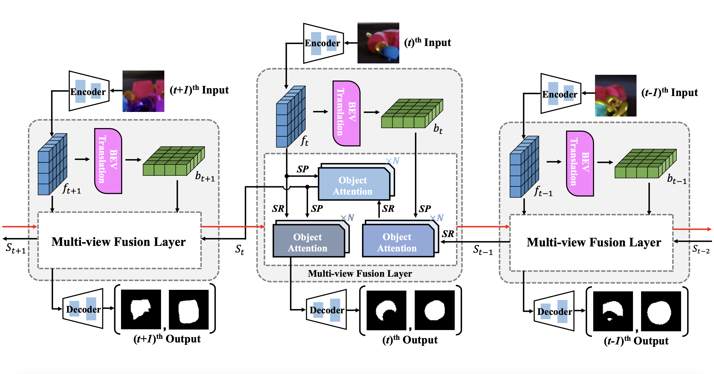
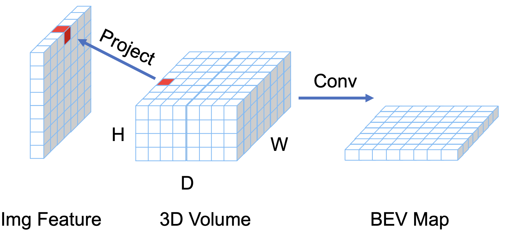
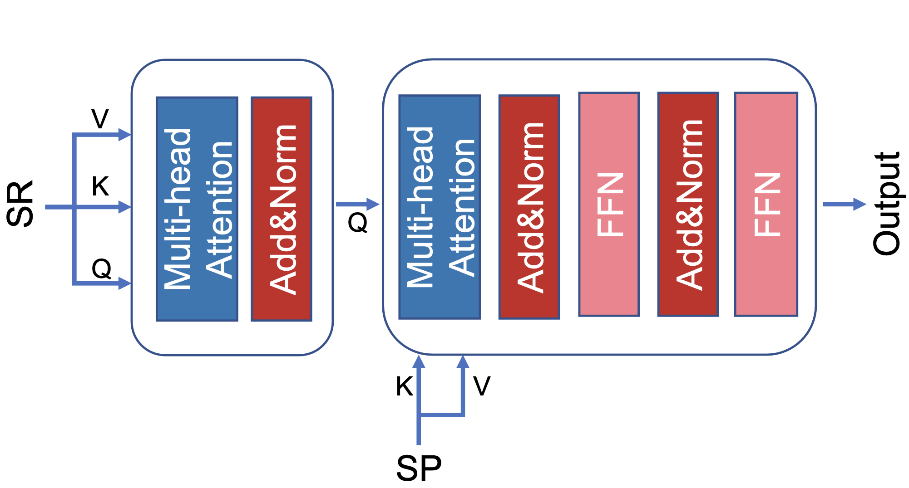

# Rethinking Amodal Video Segmentation from Learning Supervised Signals with Object-centric Representation
Ke Fan\*, Jingshi Lei\*,[Xuelin Qian†](https://naiq.github.io/), Miaopeng Yu, [Tianjun Xiao†](https://tianjunxiao.com/), [Tong He](https://hetong007.github.io/), [Zheng Zhang](https://www.amazon.science/author/zheng-zhang), [Yanwei Fu](https://yanweifu.github.io/)

# Introduction



**EoRaS**(**E**fficient **o**bject-centric **R**epresentation **a**modal **S**egmentation) is a framework designed for supervised video amodal segementation. The videos are first encoded by a convolutional neural network to get the front-view features. Then a translation module is used to project front-view features into the Bird’s-Eye View (BEV), which introduces 3D information to improve current feature quality. The front-view features and BEV features across the frames are integrated by a multi-view fusion layer based temporal module which is equipped with a set of object slots and interacts with features from different views by attention mechanism. Finally, the integrated front-view features are decoded into the visible and amodal masks.

# Code and Checkpoints
The code of EoRaS will be release upon passing the review of Amazon.

# Citation
If you find our paper useful for your research and applications, please cite using this BibTeX:

```
@InProceedings{Fan_2023_ICCV,
    author    = {Fan, Ke and Lei, Jingshi and Qian, Xuelin and Yu, Miaopeng and Xiao, Tianjun and He, Tong and Zhang, Zheng and Fu, Yanwei},
    title     = {Rethinking Amodal Video Segmentation from Learning Supervised Signals with Object-centric Representation},
    booktitle = {Proceedings of the IEEE/CVF International Conference on Computer Vision (ICCV)},
    month     = {October},
    year      = {2023},
    pages     = {1272-1281}
}
```
